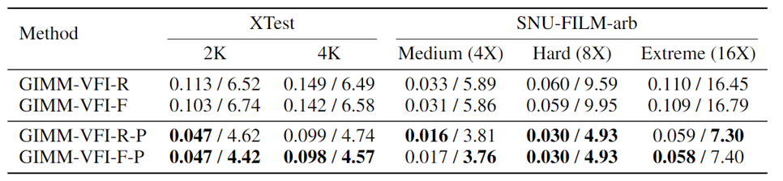

<div align="center">

<h1>Generalizable Implicit Motion Modeling </p>for Video Frame Interpolation</h1>

<div>
    <a href='https://gseancdat.github.io/' target='_blank'>Zujin Guo</a>&emsp;
    <a href='https://weivision.github.io/' target='_blank'>Wei Li</a>&emsp;
    <a href='https://www.mmlab-ntu.com/person/ccloy/' target='_blank'>Chen Change Loy</a>
</div>
<div>
    S-Lab, Nanyang Technological University&emsp; 
</div>
<div>
    <strong>NeurIPS 2024</strong>
</div>

<div>
    <h4 align="center">
        <a href="https://gseancdat.github.io/projects/GIMMVFI" target='_blank'>
        
        </a>
         <a href="http://arxiv.org/abs/2407.08680" target='_blank'>
        
<!--         </a> 
        <a href="https://https://www.youtube.com/" target='_blank'>
         -->
        </a>
        
    </h4>
</div>


<strong>GIMM-VFI performs generalizable continuous motion modeling and interpolations between two adjacent video frames at arbitrary timesteps.</strong>

:open_book: For more visual results of GIMM-VFI, go checkout our <a href="https://gseancdat.github.io/projects/GIMMVFI" target="_blank">project page</a>.

---

</div>

## News
* **2024.11.18**: Train code is release! We have also resolved an issue with ```DS_SCALE```, which should be a float between 0 and 1 for high-resolution interpolation, such as for 2K and 4K frames.
* **2024.11.08**: The ComfyUI version of GIMM-VFI is now available in the [ComfyUI-GIMM-VFI](https://github.com/kijai/ComfyUI-GIMM-VFI) repository, thanks to the dedicated efforts of @[kijai](https://github.com/kijai) :)
* **2024.11.06**: Test codes and model checkpoints are publicly available now. A perceptually enhanced version of GIMM-VFI is also released along with this update. 

## Install
* Pytorch 1.13.0
* CUDA 11.6
* CuPy
``` 
# git clone this repository
git clone https://github.com/GSeanCDAT/GIMM-VFI
cd GIMM-VFI

# create new conda env
conda create -n gimmvfi python=3.7 -y
conda activate gimmvfi

# install other python dependencies
pip install -r requirements.txt
```

## GIMM-VFI Models
GIMM-VFI can be implemented with different flow estimators. As described in our paper, we provide **RAFT-based GIMM-VFI-R** and **FlowFormer-based GIMM-VFI-F** in this repo. 

Additionally, we release a perceptually enhanced version of GIMM-VFI that incorporates an additional learning objective, the LPIPS loss, during training. Denoted as **GIMM-VFI-R-P** and **GIMM-VFI-F-P**, these enhanced variants achieve substantial improvements in perceptual interpolation.



All the model checkpoints can be found from this [link](https://huggingface.co/GSean/GIMM-VFI). Please put them into ```./pretrained_ckpt``` folder after downloading.

## Demo
Interpolation demos can be create through the following command:
```
sh scripts/video_Nx.sh YOUR_PATH_TO_FRAME YOUR_OUTPUT_PATH DS_SCALE N_INTERP
```
The model variant by default is GIMM-VFI-R-P. You can change the model variant in  ```scripts/video_Nx.sh```. 

Here is an example usage for 9X interpolation:
```
sh scripts/video_Nx.sh demo/input_frames demo/output 1 9
```
The expected interpolation output:


```DS_SCALE``` is the downsampling scale factor ranging from 0 to 1. can be adjusted for high-resolution interpolations. For instance, you can perform 8X interpolation for 2K frames using following command: 
```
sh scripts/video_Nx.sh demo/2K_input_frames demo/2K_output 0.5 8
```
The expected interpolation output can be found [here](https://entuedu-my.sharepoint.com/:v:/g/personal/zujin_guo_staff_main_ntu_edu_sg/EXM6tolfX_NIolZ0N1bamRoBW4bJon2uAk9--cLNNDBlmQ?nav=eyJyZWZlcnJhbEluZm8iOnsicmVmZXJyYWxBcHAiOiJPbmVEcml2ZUZvckJ1c2luZXNzIiwicmVmZXJyYWxBcHBQbGF0Zm9ybSI6IldlYiIsInJlZmVycmFsTW9kZSI6InZpZXciLCJyZWZlcnJhbFZpZXciOiJNeUZpbGVzTGlua0NvcHkifX0&e=kqsMEF).

In our practice, we tested GIMM-VFI on 2K and 4K frames for 8X interpolations on Nvidia V100 GPUs. Following is our settings and the corresponding memory usages:
```
[2K interpolation] DS_SCALE: 0.5 Memory-Usage: 7932MiB
[4K interpolation] DS_SCALE: 0.25 Memory-Usage: 10922MiB
```


## Dataset Preparation
* Download the [Vimeo90K](https://github.com/anchen1011/toflow?tab=readme-ov-file), [SNU-FILM](https://myungsub.github.io/CAIN/) and [X4K1000FPS](https://www.dropbox.com/scl/fo/88aarlg0v72dm8kvvwppe/AHxNqDye4_VMfqACzZNy5rU?rlkey=a2hgw60sv5prq3uaep2metxcn&e=1&dl=0) datasets.

* Obtain the motion modeling benchmark datasets, Vimeo-Triplet-Flow (VTF) and Vimeo-Septuplet-Flow (VSF), by extracting optical flows from the Vimeo90K triplet and septuplet test sets using [FlowFormer](https://github.com/drinkingcoder/FlowFormer-Official).

The file structure should be like:
```
├── data
    ├── SNU-FILM
        ├── test
        ├── test-easy.txt
        ├── test-medium.txt
        ├── test-hard.txt
        ├── test-extreme.txt
    ├── x4k
        ├── test
            ├── Type1
            ├── Type2
            ├── Type3
    ├── vimeo90k
        ├── vimeo_septuplet
            ├── sequences
            ├── flow_sequences
        ├── vimeo_triplet
            ├── sequences
            ├── flow_sequences
```

## Evaluation
### Motion Modeling: 
On the VTF benchmark:
```
sh scripts/bm_VTF.sh
```
On the VSF benchmark:
```
sh scripts/bm_VSF.sh
```

### Interpolation:
On the SNU-FILM-arb benchmark:
```
sh scripts/bm_SNU_FILM_arb.sh
```
On the X4K benchmark:
```
sh scripts/bm_X4K.sh
```
The model variants can be changed inside the shell scripts.


## Train
Following is the general command for training:
```
sh scripts/train.sh YOUR_CONFIG OUTPUT_DIR PRETRAINED_CKPT NUM_GPU
```
Specifically, you can train GIMM and GIMM-VFI by following the instructions below.
### GIMM
```
sh scripts/train.sh configs/gimm/gimm.yaml ./work_dirs '' 2
```
### GIMM-VFI-R
```
sh scripts/train.sh configs/gimmvfi/gimmvfi_r_arb.yaml pretrained_ckpt/gimm.pt 8
```
### GIMM-VFI-F
```
sh scripts/train.sh configs/gimmvfi/gimmvfi_f_arb.yaml pretrained_ckpt/gimm.pt 8
```

## Citation
If you find our work interesting or helpful, please leave a star or cite our paper. 
```text
@inproceedings{guo2024generalizable,
    title={Generalizable Implicit Motion Modeling for Video Frame Interpolation},
    author={Guo, Zujin and Li, Wei and Loy, Chen Change},
    booktitle={Advances in Neural Information Processing Systems},
    year={2024}
}
```

## Acknowledgement

The code is based on [GINR-IPC](https://github.com/kakaobrain/ginr-ipc) and draws inspiration from several other outstanding works including [RAFT](https://github.com/princeton-vl/RAFT), [FlowFormer](https://github.com/drinkingcoder/FlowFormer-Official/tree/main), [AMT](https://github.com/MCG-NKU/AMT), [softmax-splatting](https://github.com/sniklaus/softmax-splatting), [EMA-VFI](https://github.com/MCG-NJU/EMA-VFI), [MoTIF](https://github.com/sichun233746/MoTIF) and [LDMVFI](https://github.com/danier97/LDMVFI).
